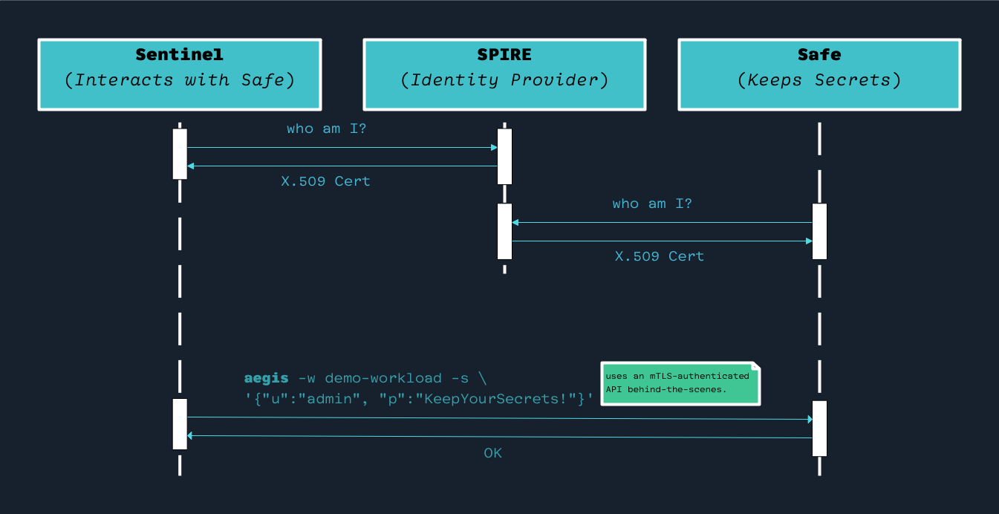

## Introduction

This documents outlines **Aegis**’ architecture details and project structure.

It is especially useful if you want to have an in-depth understanding of **Aegis**
to contribute to the project.

## Project Folder Structure

**Aegis** is a monorepo. Here’s a brief overview of essential files and folders:

* `./Makefile`: This is the file to install and test things.
* `./hack/*`: Contains various scritps that gets dirty stuff done.
* `./README.md`: The very file that you are reading.
* `./CONTRIBUTING.md`: Instructions about how to contribute to the project.
* `./CODE_OF_CONDUCT.md`: The document that tells everyone to be nice human beings.
* `./ARCHITECTURE.md`: This file that talks about the overall system architecture.
* `./DESIGN_DECISIONS.md`: Discusses various high-level design decisions and
  guiding principles we keep in mind while developing Aegis.
* `./LICENSE`: Boring copyright stuff (standard MIT License).
* `./runbook.txt`: A quick and dirty guideline to bump version etc for the 
  organization admins.

## Aegis Repositories

**Aegis** is for composed of the following repos:

* [`aegis`][aegis] is the repo you are looking at.
* [`aegis-spire`][aegis-spire] is the Identity Control Plane for Aegis.
* [`aegis-sentinel`][aegis-sentinel] is the bastion pod that you can shell
  in and add secrets to the system.
* [`aegis-sdk-go`][aegis-sdk-go]: Aegis Go SDK, for workloads to directly
  talk to [`aegis-safe`][aegis-safe] instead of using
  [`aegis-sidecar`][aegis-sidecar].
* [`aegis-safe`][aegis-safe] does all the dirty works. It is “**the**” secrets
  store.
* [`aegis-sidecar`][aegis-sidecar] is what’s injected to workloads to let them
  talk to `aegis-safe`.
* [`aegis-demo-workload-using-sidecar`][demo-sidecar] has the source code of
  a demo workload that can consume secrets using [`aegis-sidecar`].
* [`aegis-demo-workload-using-sdk`][demo-sdk] has the source code of a demo
  workload that can consume secrets directly, without a sidecar, using
  [`aegis-sdk-go`][aegis-sdk-go].
* [`aegis-core`][aegis-core] contains common modules that are used across 
  projects.
* [`aegis-web`][aegis-web] has the code of https://aegis.z2h.dev/, 
  the official website of **Aegis**.

[aegis]: https://github.com/zerotohero-dev/aegis
[aegis-spire]: https://github.com/zerotohero-dev/aegis-spire
[aegis-core]: https://github.com/zerotohero-dev/aegis-core
[aegis-sdk-go]: https://github.com/zerotohero-dev/aegis-sdk-go
[aegis-safe]: https://github.com/zerotohero-dev/aegis-safe
[aegis-sentinel]: https://github.com/zerotohero-dev/aegis-sentinel
[aegis-sidecar]: https://github.com/zerotohero-dev/aegis-safe
[aegis-web]: https://github.com/zerotohero-dev/aegis-web
[demo-sidecar]: https://github.com/zerotohero-dev/aegis-workload-demo-using-sidecar
[demo-sdk]: https://github.com/zerotohero-dev/aegis-workload-demo-using-sdk

[spire]: https://spiffe.io/ "SPIFFE: Secure Production Identity Framework for Everyone"

Each folder also has their associated `README.md` files to provide further
details about each child project.

## Components of Aegis

**Aegis**, as a system, has the following components.

### SPIRE

**SPIRE** is what makes communication within **Aegis** components and workloads
possible. It dispatches x.509 SVID certificates to the required parties to make
secure mTLS communication possible.

### **Safe** (`aegis-safe`)

**Safe** stores secrets and dispatches them to workloads.

### **Sidecar** (`aegis-sidecar`)

`aegis-sidecar` is a sidecar that facilitates delivering secrets to workloads.

### **Sentinel** (`aegis-sentinel`)

**Sentinel** is a pod you can shell in and do administrative tasks such as
registering secrets for workloads.

## High Level Architecture

### Dispatching Identities

**SPIRE** is responsible for delivering short-lived X.509 SVIDs to **Aegis**
components and consumer workloads.

**Sidecar** periodically talks to **Safe** to check if there is a new secret
to be updated.


### Creating Secrets

**Sentinel** is the only place that secrets can be created and registered
to **Safe**.



### Component and Workload SVID Schemas

SPIFFE ID format wor workloads is as follows:

```text
spiffe://aegis.z2h.dev/workload/$workloadName/ns/{{ .PodMeta.Namespace }}
/sa/{{ .PodSpec.ServiceAccountName }}/n/{{ .PodMeta.Name }}
```

For the non-aegis-system workloads that **Safe** injects secrets,
`$workloadName` is determined by the workload’s `ClusterSPIFFEID` CRD.

For `aegis-system` components we use `aegis-safe` and `aegis-sentinel` 
for the `$workloadName`:

```text
spiffe://aegis.z2h.dev/workload/aegis-safe/ns/{{ .PodMeta.Namespace }}
/sa/{{ .PodSpec.ServiceAccountName }}/n/{{ .PodMeta.Name }}

```text
spiffe://aegis.z2h.dev/workload/aegis-sentinel/ns/{{ .PodMeta.Namespace }}
/sa/{{ .PodSpec.ServiceAccountName }}/n/{{ .PodMeta.Name }}
```