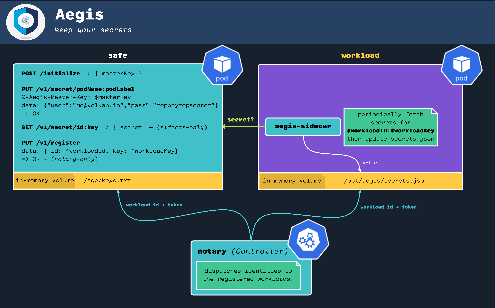
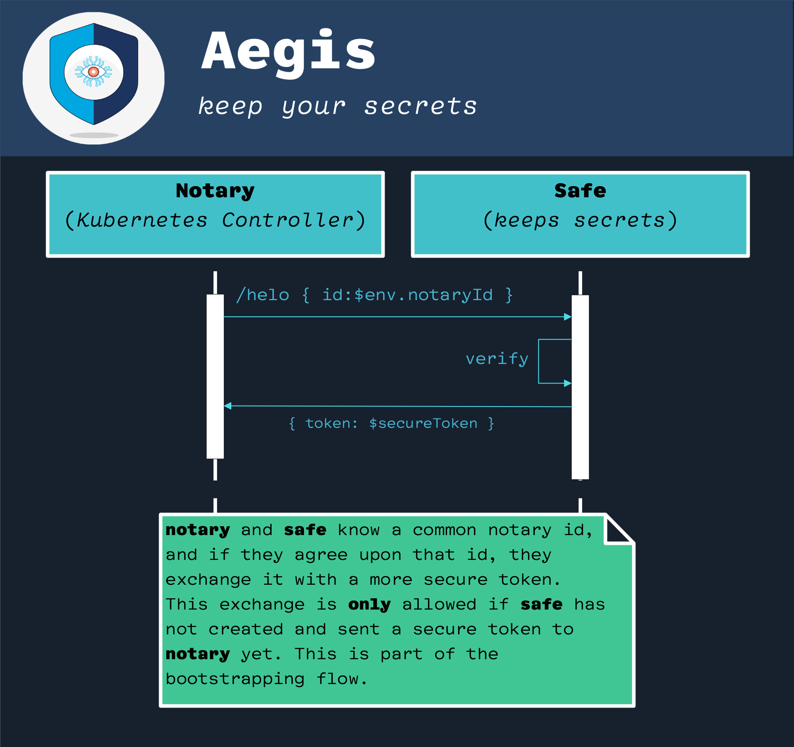
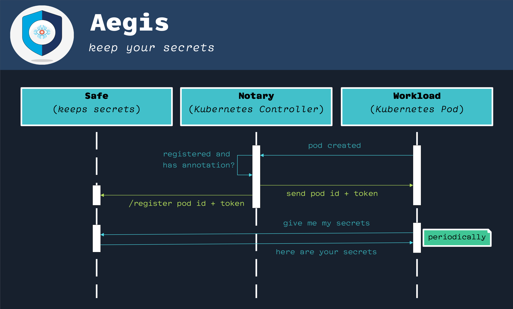

```text
 .-'_.---._'-.
 ||####|(__)||   Protect your secrets, protect your business.
   \\()|##//       Secure your sensitive data with Aegis.
    \\ |#//                  <aegis.z2h.dev>
     .\_/.
```


## Status of This Software

**Work In Progress**.

This project is a work in progress.

Stay tuned. More to come.

## About Aegis

**Aegis** is a comprehensive secrets management solution that helps you keep 
your secrets secret. With **Aegis**, you can rest assured that your sensitive 
data is **secure** and **protected** at all times. 

With its industry-standard encryption capabilities, **Aegis** ensures that your 
secrets are only accessible to authorized users, helping you safeguard your 
business and protect against data breaches.

## Project Folder Structure

// TODO: this is a monorepo; explain how it works.

// TODO: explain the project’s folder structure.

// TODO: comparison with vault.
// much less moving parts
// much simpler 
// very little footprint
// perfect for storing arbitrary configuration info
// future plans include cloud KMS integration thanks to Mozilla sops.
// simple api
// extremely small attack surface.

// TODO: talk about constraints as in:
// * This is a Kubernetes-first Cloud Native project
// * will start with a minimal API set.
// * Initially, the configuration and integration options will be limited.
// * There will be a timeline and a list of features that will be added.
// * There will be a place to provide feedback and request more features.

// TODO: talk about system requirements; where Aegis is tested and how.

// TODO: Right now, there is only a single person behind this thing (yours truly)
// that has its advantages (as me being the benevolent dictator) but also 
// limitations (I work on Aegis on my **persona** time).

// TODO: to docs: using a `todo.txt` format to track issues, as this is 
// the fastest way to bootsrap a project. Will continue to do text-base
// issue management until the project is either mature enough, or I start feeling
// some pain. — maybe I won’t need to use GitHub issues “ever”, not sure.


## Design Documents

Note that this part is highly work-in-progress. Everything is under **a lot** of
flux right now.

### Aegis High-Level Architecture



### Bootstrapping



### Sequence Diagram


