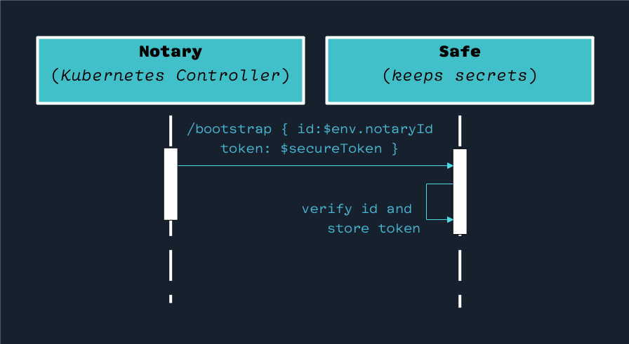
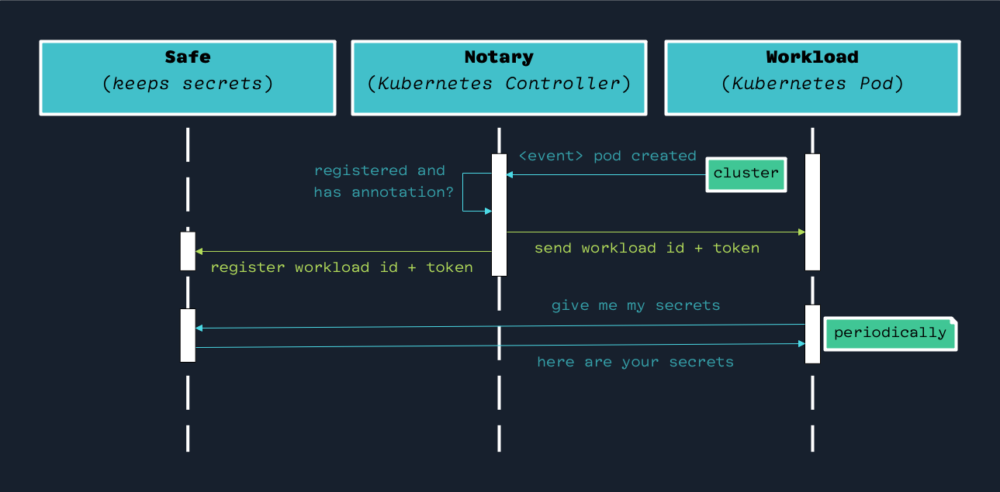

## Status of This Software

This project is a work in progress and has yet to be ready for production 
consumption. Use it at your own risk.

## Before Anything… How Do I Pronounce “Aegis”?

“Aegis” is a word of Greek origin and is pronounced `EE-jiss`. 

[Here’s a YouTube pronunciation guide][pronounce].

[pronounce]: http://www.youtube.com/watch?v=x4bUgXWdNfM

**Aegis** has two definitions:

1. (Classical Mythology) The shield or breastplate of Zeus or Athena, bearing 
   at its center the head of the Gorgon. 
2. Protection; support.

Here’s an image of an aegis (*shield*) as depicted in Greek mythology:


## A Video Is Worth a Lot of Thousands of Words

[Here is a six-minute video introduction to Aegis][aegis-demo-video].

There is also [aegis.z2h.dev][aegis-website], the project’s website.

[aegis-website]: https://aegis.z2h.dev/ "Aegis webiste"
[aegis-demo-video]: https://vimeo.com/v0lkan/aegis "Introducing Aegis: A Cloud Native Solution to Secure Your Sensitive Data"

## About Aegis

**Aegis** is perfect for storing arbitrary configuration information at a 
central location and securely dispatching it to workloads.

**Aegis** is a lightweight secrets management solution that keeps your secrets
secret. With **Aegis**, you can rest assured that your sensitive data is 
always **secure** and **protected**. 

**Aegis** ensures that your secrets are only accessible to authorized workloads, 
helping you safeguard your business and protect against data breaches.

If you haven’t watched [this six-minute introductory video yet][aegis-demo-video],
now might be a good time 🙂.

Keeping *Aegis* **slim**, **secure**, and **boringly-easy** to install and 
operate are the three pillars of the project. 

We follow the **guidelines** outlined in the next few sections to achieve these.

Since **Aegis** is still in development, some of these goals discussed in the 
following sections may still need to be fully implemented. Regardless, 
they are the **guiding principles** we steer towards while shaping the future 
of **Aegis**.

### Be Cloud Native

**Aegis** is designed to run on Kubernetes and **only** on Kubernetes. 
That helps us leverage Kubernetes concepts like *Operators*, *Custom Resources*, 
and *Controllers* to our advantage to simplify workflow and state management. 

If you are looking for a solution that runs outside Kubernetes or as a 
standalone binary, then Aegis is not the Secrets Store you’re looking for.

### Do One Thing Well

At a 5000-feet level, **Aegis** is a secure Key-Value store. It can securely 
store arbitrary values that you, as an administrator, associate with keys. It 
does that, and it does that well.

If you are searching for a solution to create and store X.509 certificates, create
dynamic secrets, automate your PKI infrastructure, federate your identities,
use as an OTP generator, policy manager, in short, anything other than a
secure key-value store, then Aegis is likely not the solution you are looking 
for.

### Have a Minimal and Intuitive API

As an administrator, there is a limited set of API endpoints that you can 
interact with **Aegis**. This makes **Aegis** easy to manage. In addition,
a minimal set of APIs means a smaller attack surface, a smaller footprint, and
a codebase that is easy to understand, test, audit, and develop; all good things.

### Be Practically Secure

Corollary: Do not be annoyingly secure. Provide a delightful user experience
while taking security seriously.

**Aegis** is a secure solution, yet still delightful to operate. 
You won’t have to jump over the hoops or wake up in the middle of the night
to keep it up and running. Instead, **Aegis** will work seamlessly, as if it 
doesn’t exist at all.

## Secure By Default

**Aegis** stores your sensitive data in memory by default. Yes, that brings 
up resource limitations since you cannot store a gorilla holding a banana and
the entire jungle in your store; however, a couple of gigabytes of RAM can store
a lot of plain text secrets in it, so it’s good enough for most practical 
purposes. 

More importantly, almost all modern instruction set architectures and 
operating systems implement [*memory protection*][memory-protection]. The primary 
purpose of memory protection is to prevent a process from accessing memory that 
has not been allocated to it. This prevents a bug or malware within a process 
from affecting other processes or the operating system itself.

[memory-protection]: https://en.wikipedia.org/wiki/Memory_protection "Memory Protection (Wikipedia)"

Therefore, reading a variable’s value from a process’s memory is practically 
impossible unless you attach a debugger to it.

So, until we implement ways to securely store a backup of the state data
encrypted on disk, all the secrets **Aegis** has will be held in memory
only: Never persisted to disk and never written or streamed to log files.

Other related works are in progress to make **Aegis**’s system 
architecture secure by default. We are slowly and steadily getting there.
You can check out [aegis.txt](aegis.txt) for the overall progress of 
what has been done and what is in progress.

## Where NOT To Use Aegis

Aegis is **not** a Database, nor is it a distributed caching layer. Of course,
you may tweak it to act like one if you try hard enough, yet, that is 
generally not a good use of the tool.

Aegis is suitable for storing secrets and dispatching them; however, it
is a *terrible* idea to use it as a centralized database to store everything
but the kitchen sink.

Use Aegis to store service keys, database credentials, access tokens, 
etc. However, **do not** use Aegis to store the username and
passwords of your 1000 customers: That’s what a database is for (*where you
hopefully hash and salt the passwords before you store them*).

## Hey, Where Are the GitHub Issues?

Right now, [there is a single text file](aegis.txt) that lists all the issues
in [todo.txt format][todo-txt]. 

This is the fastest way to bootstrap a project, and it is also the best way for 
me to manage things as I am the only developer working on the project with a 
**very** tight time budget. I literally do not have time to triage and label 
GitHub issues.

Once the project matures enough and I have a more maintainable development
burden, I’ll move items on the [aegis.txt](aegis.txt)
file to GitHub issues and GitHub projects.

[todo-txt]: https://github.com/todotxt "todo.txt"

## Project Timeline

Check [aegis.txt](aegis.txt) for task prioritization and timeline information.

For a quick guideline to parse that text file.

Let’s say you see the following line in `aegis.txt`:

```text 
(A) a mini operations manual on README.md due:2022-12-24 +aegis @▶️
```

It would mean:

* This is very important (`(A)`: *sorted alphabetically: 
  `A` is the most important, `Z` is least important*)
* It is associated with the `+aegis` projects.
* It is a work in progress (`@▶️`).
* It is guesstimated to be done by `2022-12-24`, with no promises.

## Components of Aegis

**Aegis**, as a system, has the following components.

### **Safe** (`aegis-safe`)

**Safe** stores secrets and dispatches them to workloads.

### **Sidecar** (`aegis-sidecar`)

`aegis-sidecar` is a sidecar that facilitates delivering secrets to workloads.

## **Notary** (`aegis-notary`)

A [Kubernetes Controller][k8s-controller] that lets **Safe** and the **Sidecar**s 
securely communicate with each other.

## **Sentinel** (`aegis-sentinel`) 

**Sentinel** is a pod you can shell in and do administrative tasks such as 
registering secrets for workloads. 

**Sentinel** is a Swiss army knife that should **NOT** run on production. If you 
have to diagnose the production system using *Sentinel*, it is strongly 
recommended that you *delete* Sentinel when you no longer need it—you have been 
warned.

[k8s-controller]: https://kubernetes.io/docs/concepts/architecture/controller/ "Kubernetes Controller"

## Installation

You need a **Kubernetes** cluster and sufficient admin rights on that cluster to
install **Aegis**.

As of now, the only installation option is to clone the project and install
it using `make` as follows:

```bash 
git clone https://github.com/zerotohero-dev/aegis.git
cd aegis
make install
```

## Registering a Secret to a Workload

Here is a sample Kubernetes deployment descriptor for a workload that 
**Aegis** can inject secrets:

```yaml
apiVersion: apps/v1
kind: Deployment
metadata:
  name: aegis-workload-demo
  namespace: default
  labels:
    app: aegis-workload-demo
spec:
  replicas: 1
  selector:
    matchLabels:
      app: aegis-workload-demo
  template:
    metadata:
      labels:
        app: aegis-workload-demo
      annotations:
        # Required for Aegis to identify the workload.
        aegis-workload-key: aegis-workload-demo
    spec:
      containers:
        - name: main
          image: busybox:latest
          volumeMounts:
          - mountPath: /opt/aegis
            name: aegis-secrets-volume
        # We don’t have automatic sidecar injection yet, so you’ll need to
        # manually add the sidecar.
        - name: sidecar
          image: z2hdev/aegis-sidecar:0.5.7
          ports:
          - containerPort: 8039
          volumeMounts:
          # This is where the secrets file will be written.
          - mountPath: /opt/aegis
            name: aegis-secrets-volume
          env:
          - name: AEGIS_APP_NAME
            value: "aegis-sidecar"
          - name: AEGIS_PORT
            value: ":8039"
          # Make this something random and unique.
          # `aegis-notary` and `aegis-sidecar` must have the same environment
          # variable, otherwise the bootstrapping will fail.
          - name: AEGIS_NOTARY_ID
            value: "AegisRocks"
      volumes:
        - name: aegis-secrets-volume
          emptyDir:
            medium: Memory
```

Assuming we have **Aegis** up and running, and the above workload deployed, 
to register a secret, you can execute the following API call from the **Sentinel**
(*or any other place that has a network route to **Safe**).

```bash
http PUT http://aegis-safe.aegis-system.svc.cluster.local:8017/v1/secret \
  token=$ADMIN_TOKEN \
  key=aegis-workload-demo \
  value='{"username": "me@volkan.io", "password": "ToppyTopSecret"}'
```

Where `$ADMIN_TOKEN` is the token that you get using the **Sentinel**.

You can also do the same using **Sentinel**:

```bash 
# replace aegis-sentinel-aabbccdd-11223344
# with the pod name you have on the system.
kubectl exec -it aegis-sentinel-aabbccdd-11223344 -n aegis-system -- /bin/zsh
cd /tests
vim ./create.sh
./create.sh
```

## How Do I Get the Admin Token?

Unfortunately, this is a work in progress at the moment ☹️.

As a temporary workaround, the **Safe** Pod displays the admin token in its logs
during the bootstrapping process. Note that this is pretty insecure, and we
will remove the log line once we establish a secure way to deliver the admin 
token.

## Where Do I Store the Admin Token?

Keep the admin token safe; **do not** store it in source control; **do not** 
store it on disk as plain text. An ideal place to store it is a password manager 
or an encrypted file that only the administrators know how to decrypt.

## Project Folder Structure

**Aegis** is a monorepo. Here’s a brief overview of essential files and folders:

* `./Makefile`: This is the file to install and test things.
* `README.md`: The very file that you are reading.
* `CONTRIBUTING.md`: Instructions about how to contribute to the project.
* `CODE_OF_CONDUCT.md`: The document that tells everyone to be nice human beings.
* `./demo`: A demo workload that can be used to test **Aegis**’s functionality.
* `./notary`: Source code of **Notary** (`aegis-notary`) which is a Kubernetes
  controller that acts as the mediator between **Safe** and workloads.
* `./safe`: Source code of **Safe** (`aegis-safe`). **Safe** is where all the
  secrets are stored, so you better keep it extra safe with proper RBAC. That is
  true for all **Aegis** components, but extra-true for **Safe**.
* `./sentinel`: Source code for **Sentinel**. **Sentinel** is a utility pod 
  that you can diagnose the system and do administrative tasks.
* `./sidecar`: Source code of **Sidecar** (`aegis-sidecar`), a sidecar that’s
  injected to workloads to fetch secrets from **Safe**/

Each folder also has their associated `README.md` files to provide further details
about each child project.

## Safe’s Bootstrapping Process

Bootstrapping is when **Notary** talks to **Safe** to deliver secure and 
randomly generated admin token and notary token.



**Notary** exchanges its token (*which is safe, but still known*)
with a more secure, unknown, randomly-generated token.

Bootstrapping is automatically done by **Notary**. It does not need any manual
intervention. Without successful bootstrapping, almost nothing works in the 
system.

Bootstrapping is only done **once**. Executing the bootstrap flow on **Safe** 
more than once is a **no-op**.

It is important to note that the notary id is **never** used anywhere in the
system after a successful bootstrap, and the bootstrapping typically happens
blazing fast.

## Dispatching Workload Ids and Secrets

**Notary** is also responsible for dispatching the workload ids and secrets to
workloads and notifying **Safe** about those ids and secrets, so that
workloads can communicate with **Safe** safely.

After a successful bootstrap, here’s how **Notary** dispatches ids and secrets
at a high level:



The **id** provided to the workload is the **id** that is the value of 
`aegis-workload-key` annotation in its deployment template. **Notary** will not
dispatch secrets to pods that don’t have this annotation.

## Workload Fetching Secrets

After receiving their **id** and **secret**, the **Sidecar** will
periodically call **Safe** to fetch and update the Pod’s secrets (*see the
bottom two line of the above sequence diagram*).

## System Requirements

**Aegis** has been recently tested with the following Kubernetes version:

```text
Client Version: v1.26.0
Kustomize Version: v4.5.7
Server Version: v1.25.3
```

Although not explicitly tested, any recent Kubernetes installation will work 
just fine.

As in any secrets management solution, your compute and memory requirements 
will depend on several factors, such as:

* The number of workloads in the cluster.
* The number of secrets **Aegis** has to manage.
* **Notary** refresh interval.
* **Sidecar** poll frequency.

We recommend you benchmark with a realistic production-like 
cluster and allocate your resources accordingly.

## Code Of Conduct

[Be a nice citizen](CODE_OF_CONDUCT.md).

## Contributing

It’s a bit chaotic around here, yet if you want to lend a hand,
[here are the contributing guidelines](CONTRIBUTING.md).

## Maintainers

As of now, I, [Volkan Özçelik][me], am the sole maintainer of **Aegis**.

[me]: https://github.com/v0lkan "Volkan Özçelik"

Please send your feedback, suggestions, recommendations, and comments to
[me@volkan.io](mailto:me@volkan.io). I’d love to have them.
