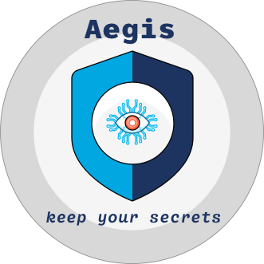

# Contributing

When contributing to this repository, please first discuss the change you wish 
to make via issue, email, or any other method with the owners of this repository 
before making a change. That will save time for everyone.

Please note [we have a code of conduct](CODE_OF_CONDUCT.md), please follow it 
in all your interactions with the project.

## Pull Request Process

1. Ensure that all components build and function properly on a local Kubernetes
   cluster (*such as minikube*).
2. Update necessary `README.md` documents.
3. Keep the pull request as granular as possible, since reviewing large amount
   of code can be error-prone (*not to mention time-consuming for the reviewers*).
4. Follow the discussion under the pull request and proceed accordingly.

## Building Aegis for Development

To build **Aegis** from source code and develop locally, 
[follow the contributing guidelines][contributing].

If you are a maintainer, and you are cutting a release,
[follow the release guidelines][release].
